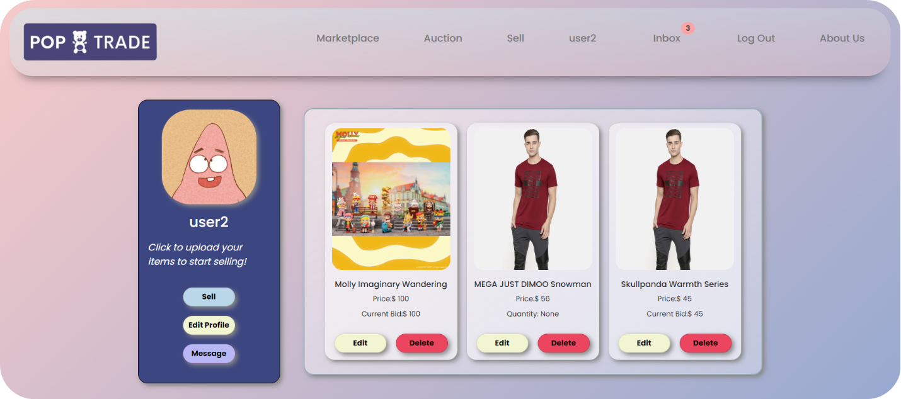
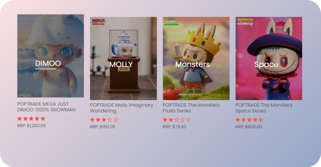
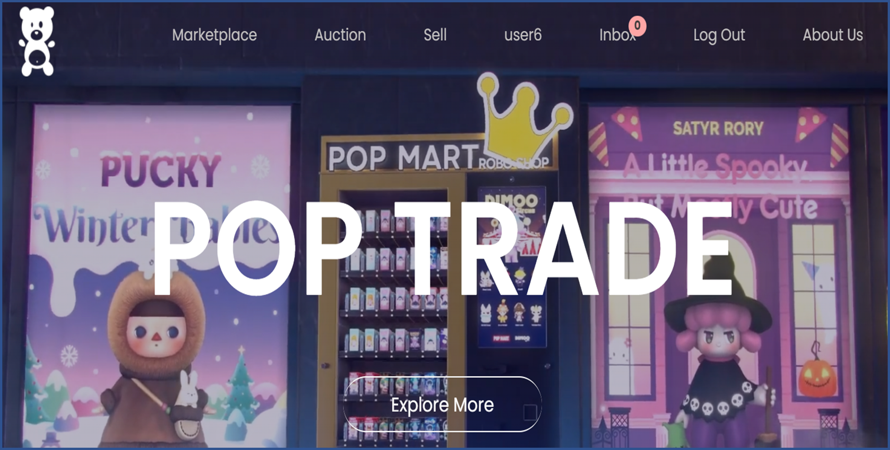

# PopTrade

PopTrade is a web-based consumer marketplace that facilitates seamless buying and selling of products. The platform offers robust user account management, product listings, and search functionalities, providing a smooth and intuitive user experience.

## Tech Stack

- **Frontend**: HTML, CSS, JavaScript
- **Backend**: Flask, Python
- **Database**: MySQL

## Features

- User account management
  
- Product listing and search functionalities
  
- Real-time chat for users
- Secure login system
  

## Getting Started

### Prerequisites

- Python 3.x installed
- MySQL database set up

### Running the Project

1. Clone the repository to your local machine.
2. Navigate to the project directory.
3. Run the project by executing the `./run.bat` file:
   ```bash
   ./run.bat
   ```
4. Open your web browser and go to `http://localhost:5000` to access the website.

### Accessing Chat

- The chat functionalities are available at `http://localhost:5000/chat`.

### Default Login

- **Username**: `user2`
- **Password**: `123`
